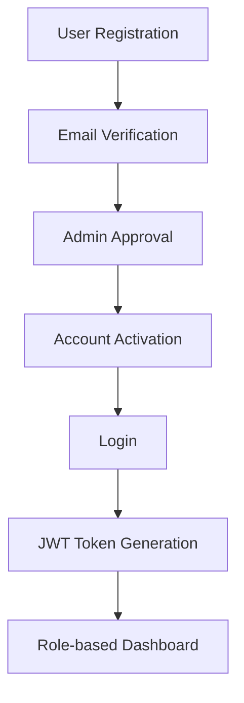
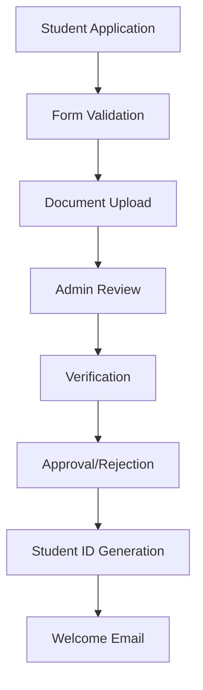
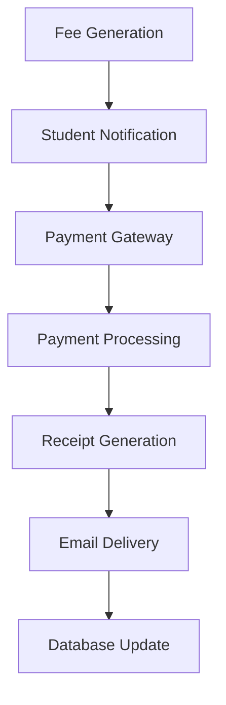
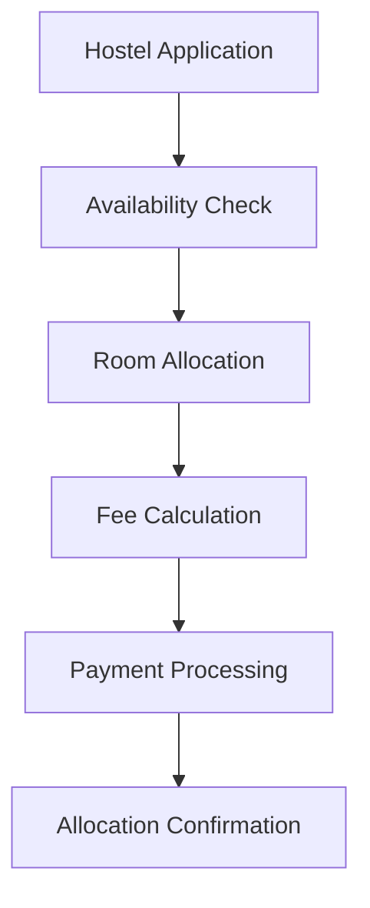
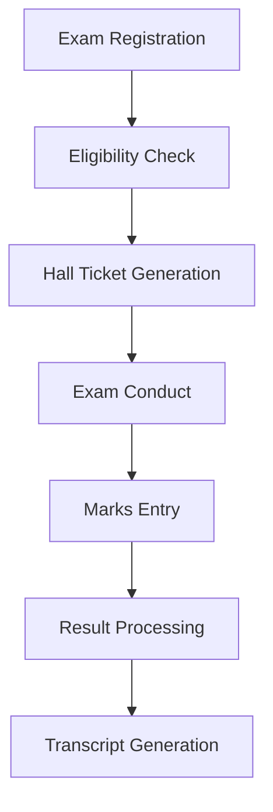

# 🏗️ ERP Student Management System - Architecture Overview

## 📋 Table of Contents
1. [System Architecture](#system-architecture)
2. [Technology Stack](#technology-stack)
3. [Database Design](#database-design)
4. [Authentication & Security](#authentication--security)
5. [Module Workflow](#module-workflow)
6. [API Architecture](#api-architecture)
7. [Deployment Strategy](#deployment-strategy)
8. [Future Enhancements](#future-enhancements)

---

## 🏗️ System Architecture

### High-Level Architecture
```
┌─────────────────────────────────────────────────────────────────┐
│                        CLIENT LAYER                            │
├─────────────────────────────────────────────────────────────────┤
│  Web App (Next.js)  │  Mobile App (React Native)  │  PWA      │
│  - Student Portal   │  - Staff App               │  - Offline │
│  - Admin Dashboard  │  - Faculty App             │  - Sync    │
└─────────────────────────────────────────────────────────────────┘
                                │
                                ▼
┌─────────────────────────────────────────────────────────────────┐
│                      API GATEWAY LAYER                         │
├─────────────────────────────────────────────────────────────────┤
│  Load Balancer  │  Rate Limiting  │  CORS  │  Authentication │
└─────────────────────────────────────────────────────────────────┘
                                │
                                ▼
┌─────────────────────────────────────────────────────────────────┐
│                      APPLICATION LAYER                         │
├─────────────────────────────────────────────────────────────────┤
│  Express.js Server  │  Socket.io  │  File Upload  │  Email Service │
└─────────────────────────────────────────────────────────────────┘
                                │
                                ▼
┌─────────────────────────────────────────────────────────────────┐
│                       SERVICE LAYER                            │
├─────────────────────────────────────────────────────────────────┤
│  Auth Service  │  Payment Service  │  Notification Service      │
│  File Service  │  AI Chatbot      │  Analytics Service         │
└─────────────────────────────────────────────────────────────────┘
                                │
                                ▼
┌─────────────────────────────────────────────────────────────────┐
│                       DATA LAYER                               │
├─────────────────────────────────────────────────────────────────┤
│  MongoDB Atlas  │  Redis Cache  │  File Storage  │  Backup     │
└─────────────────────────────────────────────────────────────────┘
```

---

## 🛠️ Technology Stack

### Frontend Technologies
```typescript
// Core Framework
- Next.js 15.5.4 (React 19.1.0)
- TypeScript
- Tailwind CSS

// State Management
- React Query (TanStack Query)
- Zustand (Global State)

// UI Components
- Lucide React (Icons)
- Recharts (Data Visualization)
- React Hook Form (Form Management)

// Additional Libraries
- Axios (HTTP Client)
- Date-fns (Date Utilities)
- Socket.io-client (Real-time)
- PWA Support (Offline Capability)
```

### Backend Technologies
```javascript
// Core Framework
- Node.js 18+
- Express.js 4.21.2
- TypeScript (Optional)

// Database & ODM
- MongoDB 5+
- Mongoose 8.0.3

// Authentication & Security
- JWT (jsonwebtoken)
- bcryptjs (Password Hashing)
- Helmet (Security Headers)
- Express Rate Limit

// File Handling
- Multer (File Upload)
- Sharp (Image Processing)
- PDF-lib (PDF Generation)

// Communication
- Socket.io (Real-time)
- Nodemailer (Email)
- Twilio (WhatsApp/SMS)

// Payment Integration
- Razorpay SDK
- Stripe SDK
```

### Database & Storage
```yaml
Primary Database:
  - MongoDB Atlas (Cloud)
  - Collections: users, students, courses, fees, hostels, examinations

Cache Layer:
  - Redis (Session Management)
  - In-memory cache for frequent queries

File Storage:
  - AWS S3 / Google Cloud Storage
  - Local storage for development

Backup Strategy:
  - MongoDB Atlas Automated Backups
  - Daily snapshots
  - Point-in-time recovery
```

---

## 🗄️ Database Design

### Core Collections

#### 1. Users Collection
```javascript
{
  _id: ObjectId,
  firstName: String,
  lastName: String,
  email: String (unique),
  phone: String,
  password: String (hashed),
  role: Enum['super_admin', 'finance_officer', 'warden', 'librarian', 'faculty', 'student'],
  status: Enum['pending', 'approved', 'suspended', 'rejected'],
  roleSpecificInfo: {
    // Student specific
    studentInfo: {
      studentId: String (auto-generated),
      course: ObjectId (ref: Course),
      semester: Number,
      academicYear: String,
      admissionDate: Date,
      documents: [String] // File URLs
    },
    // Faculty specific
    facultyInfo: {
      employeeId: String,
      department: String,
      designation: String,
      subjects: [ObjectId] // ref: Subject
    }
  },
  loginAttempts: Number,
  lastLogin: Date,
  createdAt: Date,
  updatedAt: Date
}
```

#### 2. Courses Collection
```javascript
{
  _id: ObjectId,
  courseCode: String (unique),
  courseName: String,
  duration: Number, // in years
  fees: {
    tuition: Number,
    hostel: Number,
    library: Number,
    examination: Number
  },
  subjects: [ObjectId], // ref: Subject
  status: Enum['active', 'inactive'],
  createdAt: Date
}
```

#### 3. Fees Collection
```javascript
{
  _id: ObjectId,
  studentId: ObjectId (ref: User),
  academicYear: String,
  semester: Number,
  feeType: Enum['tuition', 'hostel', 'library', 'examination'],
  amount: Number,
  dueDate: Date,
  paidAmount: Number,
  paymentStatus: Enum['pending', 'partial', 'paid'],
  paymentMethod: String,
  transactionId: String,
  receiptUrl: String,
  createdAt: Date,
  updatedAt: Date
}
```

#### 4. Hostels Collection
```javascript
{
  _id: ObjectId,
  hostelCode: String (unique),
  hostelName: String,
  totalRooms: Number,
  capacityPerRoom: Number,
  availableRooms: Number,
  facilities: [String],
  monthlyRent: Number,
  status: Enum['active', 'maintenance', 'closed'],
  createdAt: Date
}
```

#### 5. Examinations Collection
```javascript
{
  _id: ObjectId,
  examCode: String (unique),
  examName: String,
  subject: ObjectId (ref: Subject),
  examDate: Date,
  duration: Number, // in minutes
  totalMarks: Number,
  passingMarks: Number,
  hallTicketGenerated: Boolean,
  resultsPublished: Boolean,
  createdAt: Date
}
```

---

## 🔐 Authentication & Security

### JWT Implementation
```javascript
// Access Token (15 minutes)
{
  "sub": "user_id",
  "role": "student",
  "iat": 1640995200,
  "exp": 1640996100
}

// Refresh Token (7 days)
{
  "sub": "user_id",
  "type": "refresh",
  "iat": 1640995200,
  "exp": 1641600000
}
```

### Role-Based Access Control (RBAC)
```javascript
const roles = {
  super_admin: {
    permissions: ['*'], // All permissions
    modules: ['admissions', 'fees', 'hostel', 'library', 'examinations', 'users']
  },
  finance_officer: {
    permissions: ['read', 'update'],
    modules: ['fees', 'payments', 'receipts']
  },
  warden: {
    permissions: ['read', 'create', 'update'],
    modules: ['hostel', 'students']
  },
  librarian: {
    permissions: ['read', 'create', 'update'],
    modules: ['library', 'books']
  },
  faculty: {
    permissions: ['read', 'update'],
    modules: ['examinations', 'marks', 'students']
  },
  student: {
    permissions: ['read'],
    modules: ['profile', 'fees', 'hostel', 'examinations', 'marks']
  }
};
```

### Security Measures
```yaml
Data Encryption:
  - AES-256 for sensitive data
  - bcrypt for passwords
  - HTTPS/TLS for transport

API Security:
  - Rate limiting (100 req/min)
  - CORS configuration
  - Input validation & sanitization
  - SQL injection prevention

File Security:
  - Virus scanning
  - File type validation
  - Size limits
  - Secure file storage

Audit Logging:
  - All user actions logged
  - IP tracking
  - Session management
  - Failed login attempts
```

---

## 🔄 Module Workflow

### 1. Authentication Module


### 2. Admission Module


### 3. Fee Management Module


### 4. Hostel Management Module


### 5. Examination Module


---

## 🌐 API Architecture

### RESTful API Endpoints
```javascript
// Authentication Routes
POST   /api/auth/register
POST   /api/auth/login
POST   /api/auth/refresh
POST   /api/auth/logout
GET    /api/auth/profile

// Student Management
GET    /api/students
POST   /api/students
GET    /api/students/:id
PUT    /api/students/:id
DELETE /api/students/:id

// Fee Management
GET    /api/fees
POST   /api/fees
GET    /api/fees/student/:studentId
POST   /api/fees/payment
GET    /api/fees/receipt/:id

// Hostel Management
GET    /api/hostels
POST   /api/hostels
GET    /api/hostels/availability
POST   /api/hostels/allocate
GET    /api/hostels/occupancy

// Examination Management
GET    /api/examinations
POST   /api/examinations
GET    /api/examinations/student/:studentId
POST   /api/examinations/register
GET    /api/examinations/hall-ticket/:id

// Admin Routes
GET    /api/admin/dashboard
GET    /api/admin/pending-approvals
POST   /api/admin/approve-user
GET    /api/admin/analytics
```

### Real-time Features (Socket.io)
```javascript
// Real-time notifications
socket.on('fee_due_reminder', (data) => {
  // Send notification to student
});

socket.on('exam_schedule_update', (data) => {
  // Broadcast to all students
});

socket.on('hostel_allocation', (data) => {
  // Notify student about room allocation
});
```

---

## 🚀 Deployment Strategy

### Development Environment
```yaml
Frontend:
  - Next.js dev server (localhost:3000)
  - Hot reload enabled
  - Development API endpoints

Backend:
  - Express.js dev server (localhost:5000)
  - Nodemon for auto-restart
  - MongoDB local instance

Database:
  - MongoDB localhost:27017
  - Development collections
  - Seed data for testing
```

### Production Environment
```yaml
Frontend:
  - Vercel/Netlify deployment
  - CDN for static assets
  - PWA optimization

Backend:
  - AWS EC2/DigitalOcean
  - PM2 process manager
  - Nginx reverse proxy
  - SSL certificates

Database:
  - MongoDB Atlas (Cloud)
  - Automated backups
  - Read replicas
  - Monitoring & alerts
```

### CI/CD Pipeline
```yaml
GitHub Actions:
  - Code quality checks
  - Automated testing
  - Security scanning
  - Deployment automation

Testing:
  - Unit tests (Jest)
  - Integration tests
  - E2E tests (Playwright)
  - API testing (Supertest)
```

---

## 🔮 Future Enhancements

### AI & Machine Learning
```python
# AI Chatbot Integration
- Natural Language Processing
- Query understanding
- Automated responses
- Learning from interactions

# Predictive Analytics
- Admission trend analysis
- Fee collection forecasting
- Hostel demand prediction
- Student performance insights
```

### Blockchain Integration
```solidity
// Smart Contract for Certificates
contract CertificateIssuance {
    function issueCertificate(
        address student,
        string memory course,
        uint256 completionDate
    ) public onlyAuthorized;
    
    function verifyCertificate(
        bytes32 certificateHash
    ) public view returns (bool);
}
```

### Mobile Applications
```typescript
// React Native App
- Cross-platform development
- Offline synchronization
- Push notifications
- Biometric authentication
- Camera integration for document scanning
```

### Advanced Features
```yaml
WhatsApp Integration:
  - Automated notifications
  - Fee reminders
  - Exam alerts
  - Status updates

Offline Support:
  - PWA implementation
  - Service workers
  - Local storage
  - Sync when online

Analytics Dashboard:
  - Real-time metrics
  - Custom reports
  - Data visualization
  - Export capabilities
```

---

## 📊 Performance Metrics

### Key Performance Indicators (KPIs)
```yaml
System Performance:
  - API response time: <200ms
  - Page load time: <3s
  - Uptime: 99.9%
  - Error rate: <0.1%

User Experience:
  - Registration completion rate: >95%
  - Payment success rate: >98%
  - User satisfaction: >4.5/5
  - Support ticket resolution: <24h

Business Metrics:
  - Fee collection efficiency: >90%
  - Admission processing time: <48h
  - Hostel occupancy rate: >85%
  - Exam result processing: <24h
```

---

## 🔧 Development Guidelines

### Code Standards
```javascript
// ESLint Configuration
{
  "extends": ["@next/eslint-config-next"],
  "rules": {
    "no-console": "warn",
    "prefer-const": "error",
    "no-unused-vars": "error"
  }
}

// Prettier Configuration
{
  "semi": true,
  "trailingComma": "es5",
  "singleQuote": true,
  "printWidth": 80,
  "tabWidth": 2
}
```

### Git Workflow
```bash
# Feature Branch Workflow
git checkout -b feature/student-registration
git add .
git commit -m "feat: add student registration form"
git push origin feature/student-registration
# Create Pull Request
```

---

## 📝 Documentation

### API Documentation
- Swagger/OpenAPI specification
- Postman collection
- Interactive API explorer
- Code examples

### User Documentation
- Admin user guide
- Student portal guide
- Faculty handbook
- Troubleshooting guide

### Technical Documentation
- Architecture decisions
- Database schema
- Deployment guide
- Security policies

---

## 🎯 Success Metrics

### Short-term Goals (3 months)
- [ ] Complete authentication system
- [ ] Student registration module
- [ ] Basic fee management
- [ ] Admin dashboard

### Medium-term Goals (6 months)
- [ ] Hostel management system
- [ ] Examination module
- [ ] Payment gateway integration
- [ ] Mobile responsiveness

### Long-term Goals (12 months)
- [ ] AI chatbot integration
- [ ] Advanced analytics
- [ ] Blockchain certificates
- [ ] Mobile applications

---

*This architecture document serves as a comprehensive guide for the ERP Student Management System development and future enhancements.*
